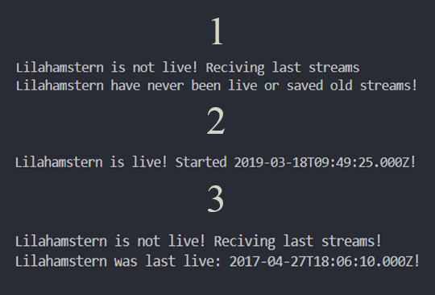

# Youtube Live Checker

Simple nodejs application that will let you see if a youtube channel is live or not! This project will probably get updated later.

## Requirements

1. NodeJS [Download](https://nodejs.org/en/)
2. Youtube Data Api V3 [Get it here](https://console.developers.google.com/apis/api/youtube.googleapis.com/overview)

## Installation

1. ```git clone https://github.com/Lilahamstern/YoutubeLiveCheck.git | Download project!```
2. ```cd YoutubeLiveCheck | Move into project folder!```
3. ```npm install | Installing node dependecys!```

## Usage

1. ```Open app.js in an text editor!```
1. ``` Edit line 4 to what channel you wanna check!```
1. ```Edit line 6 to your Youtube Data Api V3 key!```
1. ```Run node . || npm run start```

## Exemple

1. Channal is offline, could not find completed streams!
2. Channel is live, and time live stream started!
3. Channnel is offline, shows last time live!




## Contributing
Pull requests are welcome. For major changes, please open an issue first to discuss what you would like to change.

## Authors

* **Leo Rönnebro** - *Initial work* - [Lilahamstern](https://github.com/Lilahamstern)